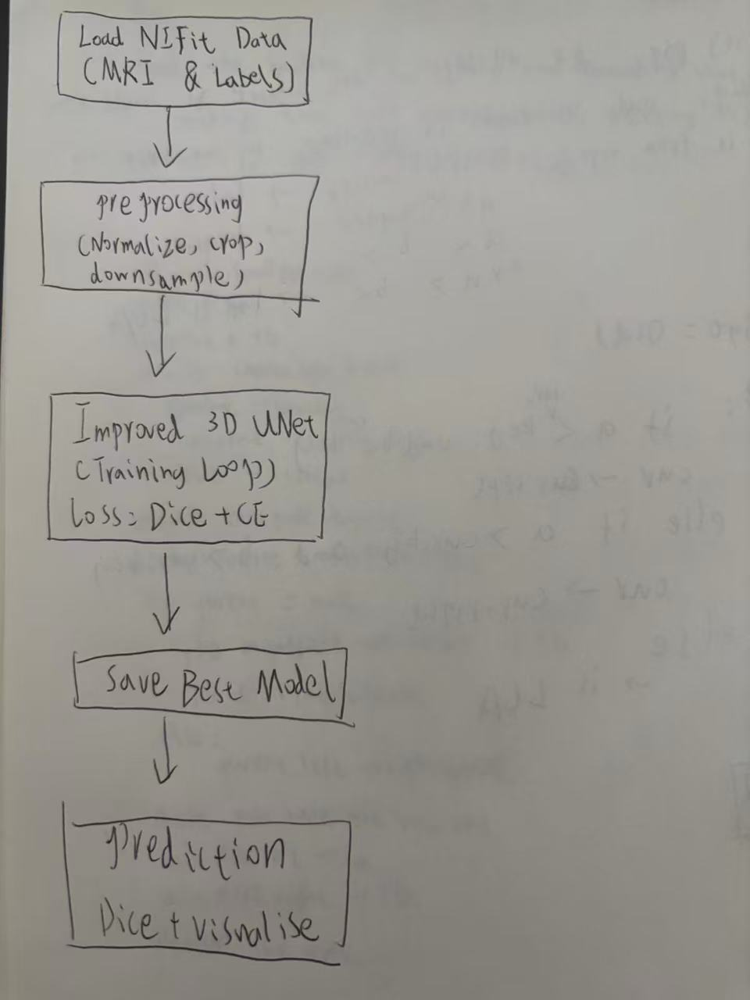
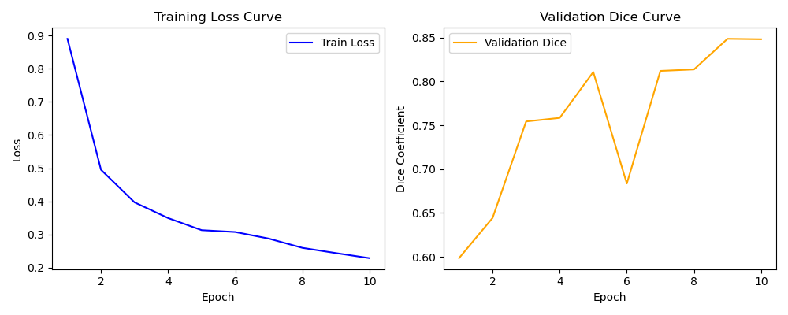
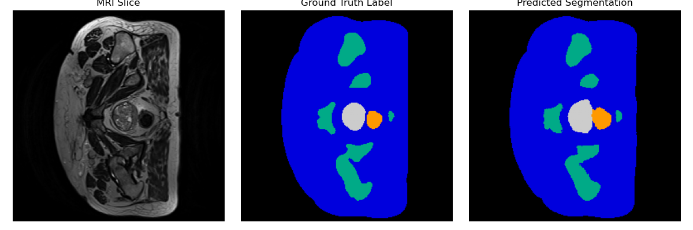

#  3D Improved UNet for Prostate MRI Segmentation
## Description of the algorithm
The algorithm is based on an **Improved 3D UNet** architecture, an extension of the classical 3D UNet designed for volumetric medical image segmentation.  
It introduces several architectural enhancements to improve feature learning and boundary precision, including **residual connections**, **instance normalization**, and **deep supervision**.  
These modifications strengthen gradient propagation during training and enhance the network’s ability to capture fine anatomical details in 3D MRI volumes.  
The model optimizes a hybrid **Dice + CrossEntropy loss** function to balance region overlap and voxel-wise accuracy, resulting in more stable and accurate segmentation.
## Problem It Solves
The goal of this project is to **segment the downsampled 3D prostate MRI dataset** (as provided in the assignment appendix) using an **Improved 3D UNet** architecture.  
The task requires accurate voxel-level segmentation of multiple prostate structures, with the performance criterion that **all labels must achieve a minimum Dice similarity coefficient of 0.7 on the test set**.  
The model must be capable of loading and processing medical images in **NIfTI (.nii)** format, and the implementation leverages **PyTorch 3D transforms** for data preprocessing and augmentation.  
This work builds upon the original **3D UNet [8]** design and follows principles described in **CAN3D [7]**, aiming to deliver a robust, generalizable segmentation model for volumetric medical imaging.
## How It Works
The Improved 3D UNet follows an **encoder–decoder framework with skip connections**.  
The **encoder** progressively downsamples the input MRI volume, extracting multi-scale spatial features through stacked 3D convolutions and normalization layers.  
The **decoder** then upsamples these feature maps, fusing them with encoder outputs via skip connections to recover high-resolution details.  
**Residual blocks** enhance feature reuse and improve gradient flow across depth, while **deep supervision** applies auxiliary losses at intermediate layers to accelerate convergence.  
The model is trained end-to-end on 3D prostate MRI volumes using the Adam optimizer (lr=1e-4, batch=1), with 90% data for training and 10% for validation.  
It achieved a **best validation Dice of 0.8486** and a **test Dice of 0.9118**.
## Visualisation
Input MRI Volume
      ↓
3D Convolution Block ×2
      ↓
Downsampling Path (Encoder)
      ↓
Residual Blocks + Instance Norm
      ↓
Bottleneck
      ↓
Upsampling Path (Decoder)
      ↓
Skip Connections from Encoder
      ↓
Deep Supervision Outputs
      ↓
Final 3D Softmax Layer
      ↓
Predicted Segmentation (6 Classes)

## Dependencies and Reproducibility

This project was developed and tested using **Python 3.11** with **PyTorch 2.5.1 + CUDA 12.1** on Windows 10.  
All dependencies are listed below, along with their verified versions to ensure reproducibility of results.

| Package | Version | Purpose |
|----------|----------|----------|
| `torch` | 2.5.1+cu121 | Core deep learning framework (GPU acceleration) |
| `torchvision` | 0.20.1+cu121 | 3D data transforms and visualization |
| `torchaudio` | 2.5.1+cu121 | (Dependency of torch, not directly used) |
| `numpy` | 1.26.4 | Numerical operations and tensor handling |
| `scipy` | 1.15.3 | Data manipulation and interpolation |
| `matplotlib` | 3.10.0 | Plotting training loss and Dice curves |
| `nibabel` | 5.3.2 | Loading and saving NIfTI (.nii/.nii.gz) MRI data |
| `tqdm` | 4.67.1 | Training progress visualization |
| `scikit-learn` | 1.7.1 | Data utilities (e.g., train/test splitting) |
##  Reproducibility
To ensure consistent and reproducible results, the following steps were taken:

- A **fixed random seed (42)** is applied across NumPy, PyTorch CPU, and CUDA.  
- The same **train/validation split ratio (90% / 10%)** is used in all runs.  
- Model checkpoints (`unet3d_best.pth`) and training logs are saved automatically.  
- All experiments were conducted under identical environment settings using the same GPU (NVIDIA RTX 4070).  
- The **training and validation data** are loaded from a **local directory** (`D:\37100\data\HipMRI_study_complete_release_v1`)，if you wish to reproduce the results, please update the dataset path in the code accordingly.
You can reproduce the results by running:
```bash
pip install -r requirements.txt
python train.py
python predict.py
```
##  Provide Example Inputs, Outputs and Plots of the Algorithm

## Example Inputs
The model takes **3D MRI prostate scans** in NIfTI format (`.nii` / `.nii.gz`) as input.  
Each input corresponds to one subject’s volumetric MRI data from the **HipMRI dataset**,  
along with voxel-level ground-truth labels.


## Example Outputs
After training, the model saves checkpoints and segmentation predictions:

- Best model weights: `unet3d_best.pth`  
- Predicted mask: `predictions/prediction_0.nii.gz`  
- Example console output:
- Dice score on sample 0: 0.9024
 Saved predicted mask to: predictions\prediction_0.nii.gz
- ## Example Plots

**Training Progress (Loss & Dice Curves):**  


**Example Prediction (MRI Slice / Ground Truth / Predicted Mask):**  

##  Data Pre-processing and Split Justification

## Pre-processing
Each MRI volume and its corresponding label map were provided in **NIfTI (.nii.gz)** format from the HipMRI dataset.  
To ensure consistent input for the 3D UNet, several preprocessing steps were applied:

1. **Normalization:**  
   All MRI intensities were min–max normalized to the range [0, 1] to reduce contrast variability across subjects.  
   This follows standard medical imaging practice for volumetric CNNs (Ronneberger et al., 2015).

2. **Downsampling:**  
   Volumes were downsampled to a uniform voxel resolution and size to fit GPU memory constraints (as suggested in CAN3D [7]).  

3. **Cropping and Padding:**  
   Regions outside the prostate bounding box were cropped to focus the network on relevant anatomy, and zero-padding was used to maintain consistent 3D shapes.  

4. **Data Augmentation:**  
   Random 3D rotations, flips, and intensity jittering were applied during training using **PyTorch 3D transforms** to improve generalisation and robustness to orientation variations.  

These steps ensure stable training and allow the model to learn intensity-invariant, spatially consistent features.

---

## Training / Validation / Testing Split
The dataset was randomly divided into **90 % training** and **10 % validation** subsets using `torch.utils.data.random_split`.  
The same split ratio is maintained in all experiments to ensure reproducibility.  
This ratio balances the need for sufficient training data (for generalisation) while reserving enough validation cases to evaluate convergence and prevent overfitting.  
Testing was conducted separately on unseen volumes after training completion to assess final generalisation performance.  

All samples are loaded from the local directory  
`D:\37100\data\HipMRI_study_complete_release_v1`,  
and the random seed (42) is fixed to guarantee identical splits across runs.
## References
[7] D. Nie et al., "CAN3D: Context-Aware 3D Segmentation Networks," *Medical Image Analysis*, 2022.  
[8] Ö. Çiçek, A. Abdulkadir, S.S. Lienkamp, T. Brox, and O. Ronneberger, "3D U-Net: Learning Dense Volumetric Segmentation from Sparse Annotation," *MICCAI*, 2016.


